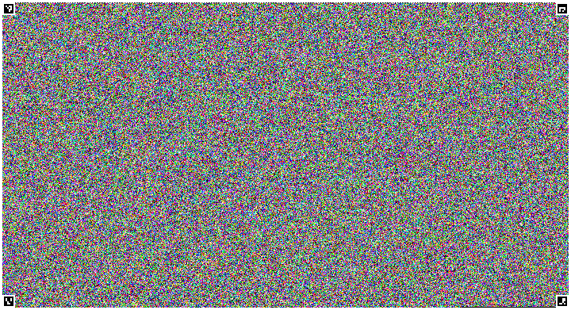
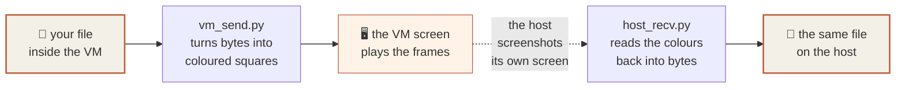
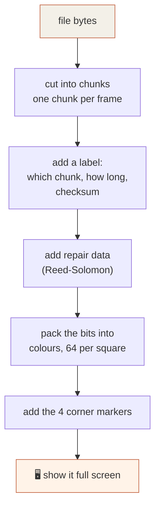
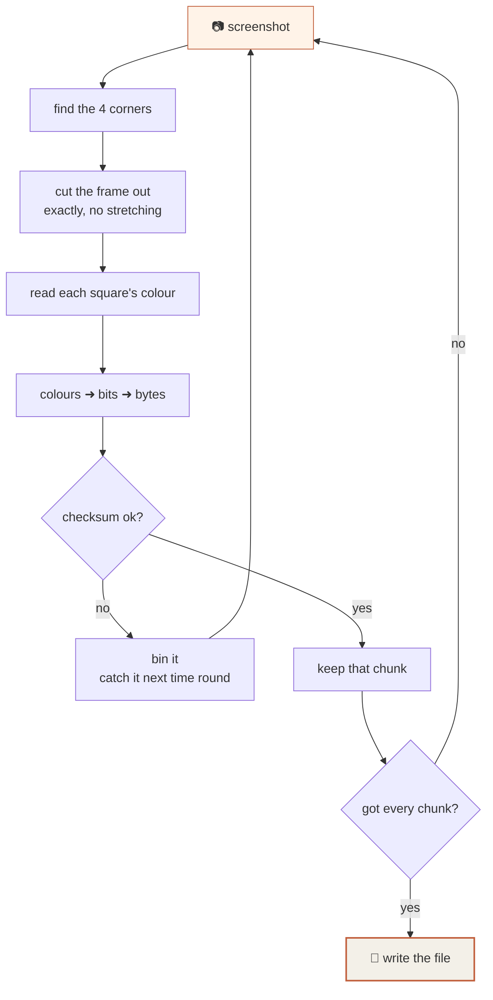
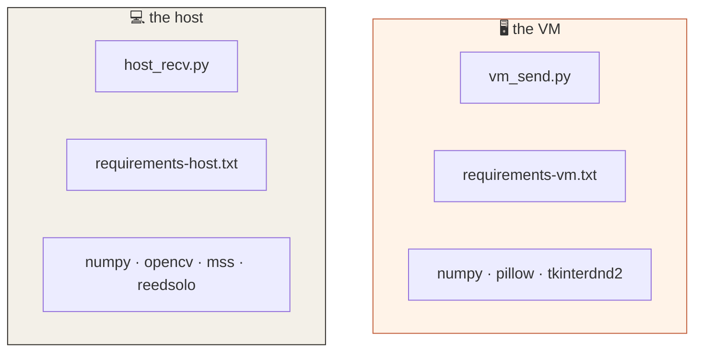
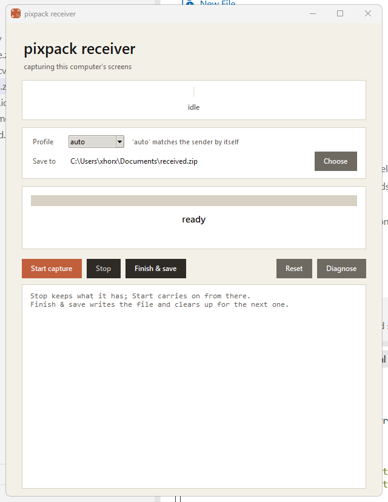
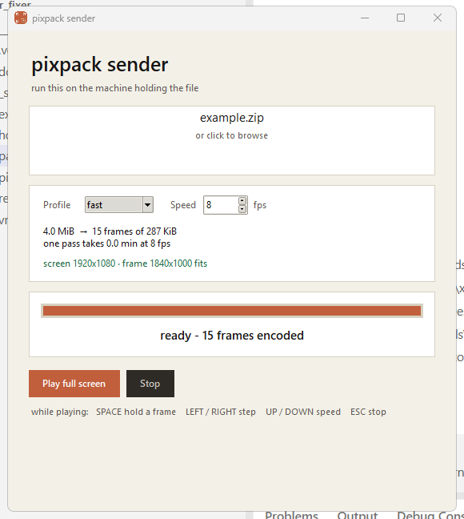
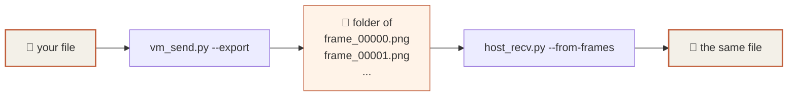

# pixpack

**Move files out of a virtual machine using nothing but the screen.**

The VM paints your file on its screen as coloured frames. The host takes
screenshots of that screen and rebuilds the file. No network, no shared folder,
no USB, just pixels.

Every transfer is checksum-verified. If a file gets written, it is
**byte-for-byte identical** to the original.

<p align="center">
  
</p>

---

## Table of contents

1. [How it works](#how-it-works)
2. [Install](#install)
3. [Use it](#use-it)
4. [Save the frames as pictures instead](#save-the-frames-as-pictures-instead)
5. [Settings](#settings)
6. [When it doesn't work](#when-it-doesnt-work)
7. [Command line](#command-line)

---

## How it works

### The big picture



The VM never sends anything. The host just looks at the screen. That is the
whole trick.

### What one frame looks like

Each frame is a grid of tiny coloured squares. Each square carries a few bits.
The four black-and-white patterns in the corners tell the host where the frame
is and how big it is.

<p align="center">
  
  <br><em>zoomed right in, each little square is data</em>
</p>

### Turning a file into frames



### Turning frames back into a file



The sender **loops forever**. If the host misses a frame, it simply catches it
on the next lap. You do not have to keep the two in sync.

### Why it can't quietly corrupt your file

Three separate checks, all of which must pass:

| check | catches |
|---|---|
| checksum on every chunk | a frame that got captured while the screen was still redrawing |
| checksum on the whole file | anything that slipped through |
| Reed-Solomon repair data | a few wrong pixels, fixed automatically |

If the checks fail, you get an error. You never get a silently broken file.

---

## Install

You need **Python 3.11 or newer** on both machines. Get it from
[python.org](https://www.python.org/downloads/) and tick
**"Add python.exe to PATH"** during setup.

Each machine gets its own `.venv` (a private folder of packages, so nothing
touches the rest of your system).

### On the host

Put `host_recv.py` and `requirements-host.txt` in a folder, say `C:\pixpack`.

Open **PowerShell** there and run:

```powershell
cd C:\pixpack
py -m venv .venv
.\.venv\Scripts\python.exe -m pip install --upgrade pip
.\.venv\Scripts\python.exe -m pip install -r requirements-host.txt
```

Check it worked:

```powershell
.\.venv\Scripts\python.exe host_recv.py --help
```

### Inside the VM

The VM only needs **two files**: `vm_send.py` and `requirements-vm.txt`. Copy
them in however you normally would (shared folder, ISO, clipboard, whatever
your setup allows). This is the only time anything needs to get *in*.

Then, in **PowerShell inside the VM**:

```powershell
cd C:\pixpack
py -m venv .venv
.\.venv\Scripts\python.exe -m pip install --upgrade pip
.\.venv\Scripts\python.exe -m pip install -r requirements-vm.txt
```

Check it worked:

```powershell
.\.venv\Scripts\python.exe vm_send.py --help
```

> **No internet in the VM?**
> On the host, download the packages first:
> ```powershell
> .\.venv\Scripts\python.exe -m pip download -r requirements-vm.txt -d wheels
> ```
> Copy the `wheels` folder in with the scripts, then inside the VM:
> ```powershell
> .\.venv\Scripts\python.exe -m pip install --no-index --find-links wheels -r requirements-vm.txt
> ```

### Which machine gets what



The VM deliberately does **not** need OpenCV. It is a big download and the
sender doesn't need it.

---

## Use it

### Step 1. Start the receiver on the host

```powershell
.\.venv\Scripts\python.exe host_recv.py
```

Pick where to save with **Choose**, then press **Start capture**.
Leave Profile on `auto`. It works out the sender's settings by itself.

<p align="center">
  
</p>

### Step 2. Send from the VM

```powershell
.\.venv\Scripts\python.exe vm_send.py
```

Drag your file onto the window. It encodes in a few seconds, then press
**Play full screen**.

<p align="center">
  
</p>

> **Want something to test with first?** `example.zip` is included. 1.5 MB
> across 15 files (PDF, Word, PowerPoint, Markdown, text, Python, JSON, CSV,
> HTML, PNG, JPEG, a raw binary blob and an empty file). Send that, then open
> what comes out the other side and check it all still works.

> Check the green line: **`screen 1920x1080 · frame 1840x1000 fits`**.
> If it is red, the frame is too big for the VM's screen. Take the profile it
> suggests, otherwise the corners get cut off and nothing will decode.

### Step 3. Wait

The host fills up its progress bar and saves the file on its own. The little
label under the preview tells you how it's going:

| label | meaning |
|---|---|
| 🔴 looking for frames | nothing on screen yet |
| 🟠 frames found, decoding | it can see them, working on it |
| 🟢 locked on `fast` | all good |

When it finishes it saves, then gets ready for the next file. Press **ESC** in
the VM to stop the player.

### Keys while playing

| key | does |
|---|---|
| `SPACE` | hold the current frame still / carry on |
| `←` `→` | step one frame at a time (while held) |
| `↑` `↓` | speed up / slow down |
| `H` | back to the info screen |
| `ESC` | stop |

### Buttons on the host

| button | does |
|---|---|
| **Start capture** | begin, or carry on from where you stopped |
| **Stop** | pause, **keeps everything decoded so far** |
| **Finish & save** | write the file and get ready for the next one |
| **Reset** | throw it all away and start over |
| **Diagnose** | explain what the screen actually looks like |

---

## Save the frames as pictures instead

You do not have to scan straight away. The sender can write the frames out as
PNG files, and the receiver can rebuild the file from that folder later.

Handy if you want the pictures themselves, or want to scan on another day.



**Save the pictures**

```powershell
.\.venv\Scripts\python.exe vm_send.py example.zip --export frames
```

```
file     example.zip  (1.5 MiB)
profile  fast  ->  6 frames
folder   frames

wrote 6 PNGs to frames  (6.2 MiB on disk)
rebuild with:  python host_recv.py --from-frames frames -o example.zip
```

**Rebuild from the pictures**

```powershell
.\.venv\Scripts\python.exe host_recv.py --from-frames frames -o restored.zip
```

```
folder    frames
images    6
profile   fast  (293,852 B/frame)

restored 1,541,571 bytes -> restored.zip
checksum verified  |  6 frames  |  0 unreadable, 0 duplicates
```

Notes:

- You do not have to say which profile. It reads that from the pictures.
- **Use an empty folder.** The sender refuses to write into a folder that
  already has frames in it, so pictures from two different files can never get
  mixed up.
- The PNGs are bigger than the file itself. This is a way to carry data, not a
  way to shrink it.
- If a picture goes missing it tells you exactly which one, and writes nothing:

  ```
  incomplete: 1 of 6 frames missing
    [2]
  ```

---

## Settings

### Profiles

A profile is a trade between **speed** and **how forgiving** it is.
Bigger squares survive a blurry screen but hold less.

| profile | frame size | per frame | 100 MB = | at 8 fps | good for |
|---|---|---|---|---|---|
| `max` | 1840×1000 | 2.25 MiB | 43 frames | under a minute | a perfect, sharp display |
| `turbo` | 1840×1000 | 1.12 MiB | 85 frames | under a minute | a perfect, sharp display |
| **`fast`** | 1840×1000 | 287 KiB | 341 frames | ~1 min | **start here** |
| `fast-md` | 1360×760 | 159 KiB | 614 frames | ~1 min | smaller VM screen |
| `fast-sm` | 1000×560 | 85 KiB | 1,155 frames | ~2 min | small VM screen |
| `safe` | 1840×1000 | 61 KiB | 1,603 frames | ~3 min | slightly blurry display |
| `safe-md` | 1360×760 | 34 KiB | 2,896 frames | ~6 min | blurry, smaller screen |
| `safe-sm` | 1000×560 | 18 KiB | 5,465 frames | ~11 min | blurry, small screen |
| `tough` | 1840×1000 | 7 KiB | 14,038 frames | ~29 min | last resort |
| `tough-md` | 1360×760 | 4 KiB | 25,628 frames | ~53 min | last resort |

`-md` and `-sm` are just smaller pictures for smaller VM screens. The frame
**must fit on the VM's screen** or the corner markers get cut off.

Measured on real hardware: `fast` moves about **2.7 MB per second**, so 200 MB
takes a little over a minute.

### Speed (fps)

How many frames per second the VM shows.

- **Too fast** and the host photographs the screen while it is still redrawing.
  You get half of one frame and half of the next, and nothing decodes.
- **Too slow** and you are just waiting.

`8` is a good starting point. If nothing decodes, **drop it to 2** before you
change anything else.

---

## When it doesn't work

Press **Diagnose** on the host. It says what it can actually see.

### "no corner markers found"

The host cannot see the frames at all.

- Is the sender actually playing, or still on its info screen?
- Is another window sitting on top of the VM?
- Is the VM window minimised or scrolled off screen?

### "markers seen, but not decoding"

It can see the frames but can't read them. Diagnose will say which:

| what it says | what to do |
|---|---|
| `crop: WARPED (scaled)` | the VM window is being stretched, set it to 100% zoom |
| `colour levels seen` different from `wanted` | the display is blurry, move down the list: `fast` to `safe` to `tough` |
| geometry and colour **perfect** but checksum fails | the screen was mid-redraw, **lower the fps to 2** |

That last one is the common one. It looks alarming because everything reads as
perfect, but the top and bottom of the picture came from two different frames.

### It gets stuck partway

Let the sender keep looping, missed frames get picked up on the next lap.
If it truly won't budge, press **Stop** (your progress is kept), lower the fps
in the VM, and press **Start** again.

### The frame is bigger than the VM screen

The sender shows this in red and tells you which profile to switch to. The
corners must be visible or nothing works.

---

## Command line

Both scripts open a window by default. Add `--cli` to stay in the terminal.

**Host**

```powershell
.\.venv\Scripts\python.exe host_recv.py -o out.zip --cli
.\.venv\Scripts\python.exe host_recv.py -o out.zip --cli --profile fast
.\.venv\Scripts\python.exe host_recv.py -o out.zip --cli --timeout 300
.\.venv\Scripts\python.exe host_recv.py --from-frames frames -o out.zip
```

| option | what it does |
|---|---|
| `-o`, `--out` | where to save |
| `-p`, `--profile` | `auto` (default) or a profile name |
| `--from-frames` | rebuild from a folder of pictures instead of the screen |
| `--monitor` | `all` (default) or a monitor number |
| `--region` | `x,y,w,h` to watch one area only |
| `--workers` | decoder threads (0 = pick automatically) |
| `--timeout` | give up after N seconds |

**VM**

```powershell
.\.venv\Scripts\python.exe vm_send.py payload.zip --cli
.\.venv\Scripts\python.exe vm_send.py payload.zip --cli --profile safe --fps 4
.\.venv\Scripts\python.exe vm_send.py payload.zip --export frames
.\.venv\Scripts\python.exe vm_send.py --list-profiles
```

| option | what it does |
|---|---|
| `-p`, `--profile` | which profile to use |
| `--fps` | frames per second |
| `--export` | write the frames to a folder as PNGs, do not play them |
| `--autostart` | skip the info screen |
| `--list-profiles` | show the table above |

---

## Good to know

- **Any file works.** It reads raw bytes, so PDFs, Word, PowerPoint, Excel,
  images, video, executables, all fine. A zip is just handy for sending a lot
  at once. Verified on a 20-file bundle spanning 13 formats, including empty
  files: every one came back identical and still opened.
- **The profile does not need to match.** The host works it out from the frame.
- **Nothing is overwritten.** A second capture becomes `out_1.zip`.
- **It is not encrypted.** Anyone watching the VM screen sees the frames.
- Both scripts are **standalone single files**. Nothing else to copy.
